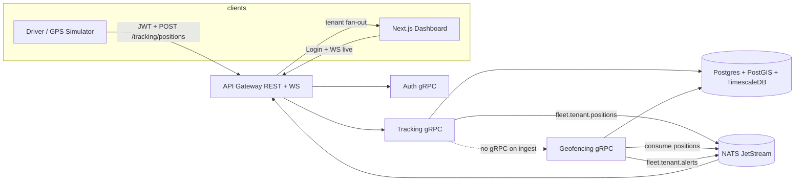

# OmniFleet

Multi-tenant fleet and logistics tracking platform — Go microservices, gRPC + REST gateway, PostGIS/TimescaleDB, NATS JetStream, Next.js dispatcher map, Kubernetes, Terraform, and Helm.

This repository delivers a **runnable vertical slice** (GPS ingest → events → geofence alerts → live dashboard) plus **production-shaped scaffolding** for the remaining services.

## Architecture



## Service map

| Service | Port (local) | Status |
|---------|--------------|--------|
| **gateway** | 8080 HTTP | **Implemented** — REST login/ingest, WebSocket live feed |
| **auth** | 50051 gRPC | **Implemented** — JWT, RBAC roles, login |
| **tracking** | 50052 gRPC | **Implemented** — GPS ingest, Timescale write, JetStream publish |
| **geofencing** | 50053 gRPC | **Implemented** — PostGIS enter/exit, alert events |
| **eta** | 50054 gRPC | Stub — health + TODO |
| **dispatch** | 50055 gRPC | Stub — health + TODO |
| **billing** | 50056 gRPC | Stub — Stripe TODO (test mode env vars) |
| **notifications** | 50057 gRPC | Stub — health + TODO |
| **web/dashboard** | 3000 | **Implemented** — MapLibre live map, tenant-scoped WS |
| **mobile/driver** | — | Scaffold — Expo metadata only; use GPS simulator locally |

## Multi-tenancy and security

- **Shared database** with `tenant_id` on all tenant-owned rows.
- **Postgres RLS** policies enforce `tenant_id = current_setting('app.tenant_id')`.
- **`FORCE ROW LEVEL SECURITY`** on tenant tables; tables are owned by `omnifleet_owner`, not the app role.
- **Runtime DB user** `omnifleet_app` (non-superuser) is what services use in docker-compose and tests.
- Without `app.tenant_id`, queries return **zero rows** (not all rows).
- Application code sets tenant context per transaction via `pkg/db.WithTenant`.
- **JWT** claims carry `tenant_id`, `user_id`, and **RBAC role** (`admin`, `dispatcher`, `driver`, `customer`).
- Gateway checks permissions before ingest/view operations.
- Login uses `auth_lookup_user()` (`SECURITY DEFINER`) because tenant context is unknown pre-auth.
- **Live map WebSocket:** clients `POST /api/v1/ws/fleet/ticket` with `Authorization: Bearer`, receive a **single-use ~30s ticket**, then connect with `Sec-WebSocket-Protocol: omnifleet.v1.<ticket>` — JWTs are not placed in query strings or access logs.
- Integration tests in `pkg/db/rls_test.go` cover tenant isolation, empty results without tenant context, and FORCE RLS / non-owner role.

## Event flow (vertical slice)

1. Driver (simulator) logs in → receives JWT scoped to tenant **Acme Logistics**.
2. `POST /api/v1/tracking/positions` → gateway → tracking gRPC.
3. Tracking writes `gps_positions` hypertable and publishes `fleet.<tenant_id>.positions` (it does **not** call geofencing gRPC).
4. Geofencing **JetStream consumer** evaluates PostGIS polygons, updates state, publishes `fleet.<tenant_id>.alerts` on enter/exit ([ADR 0004](docs/adr/0004-geofencing-via-nats-consumer.md)).
5. Gateway JetStream consumer fan-outs JSON to WebSocket clients **for that tenant only**.
6. Dashboard MapLibre marker moves; alerts panel lists geofence events.

## High availability (design)

- **Kubernetes** deployments with liveness/readiness probes (Helm charts under `deploy/helm/charts/*`).
- **HPA** on gateway/tracking (see gateway chart).
- **PodDisruptionBudgets** on gateway/auth.
- **Postgres**: Aurora cluster module with **read replica** (`deploy/terraform/modules/postgres`).
- **Terraform** (AWS): VPC, EKS, managed Postgres — `terraform validate` only in CI (no apply).

## Tech choices

| Area | Choice | Why |
|------|--------|-----|
| Event bus | **NATS JetStream** | Low ops, fast fan-out, durable streams; see [ADR 0001](docs/adr/0001-nats-jetstream-event-bus.md) |
| Multi-tenancy | **RLS** | Defense-in-depth; [ADR 0002](docs/adr/0002-shared-db-rls-multi-tenancy.md) |
| External API | **REST + WS gateway** | [ADR 0003](docs/adr/0003-api-gateway-rest-websocket.md) |
| Geofencing trigger | **NATS consumer only** | [ADR 0004](docs/adr/0004-geofencing-via-nats-consumer.md) |
| Contracts | **Protobuf + buf** | `proto/` → `gen/go/` |
| Maps | **MapLibre** | Open tiles, no vendor lock-in for portfolio demo |

## Quickstart (docker-compose)

**Prerequisites:** Docker 24+, Docker Compose v2.

```bash
cp .env.example .env
docker compose up --build
```

| URL | Purpose |
|-----|---------|
| http://localhost:3000 | Dispatcher dashboard |
| http://localhost:8080/healthz | Gateway health |

**Demo logins** (password for all: `demo-password-change-me`):

| Tenant | Dispatcher | Driver |
|--------|------------|--------|
| Acme Logistics | `dispatcher@acme.test` | `driver@acme.test` |
| Globex Freight | `dispatcher@globex.test` | `driver@globex.test` |

The `gps-simulator` service moves **Acme Truck 1** through the SF depot geofence. Sign in as Acme dispatcher to watch the map and alerts (Globex users must not see Acme events).

### Local development (without Docker)

```bash
make proto
# Start Postgres 16 + Timescale + PostGIS, NATS (-js), then:
make build
./bin/auth & ./bin/tracking & ./bin/geofencing & ./bin/gateway &
cd web/dashboard && npm install && npm run dev
go run ./scripts/gps-simulator
```

## Testing

```bash
make test          # unit tests (RBAC, geofence, events)
make test-rls      # requires DATABASE_URL with seeded schema
make tf-validate
make helm-lint
```

## Deployment guide

1. **Infrastructure:** `cd deploy/terraform && terraform init && terraform plan` (AWS VPC + EKS + Aurora). Do not apply from CI.
2. **Images:** build per-service Dockerfiles in `deploy/docker/Dockerfile.go`.
3. **Kubernetes:** `helm upgrade --install gateway deploy/helm/charts/gateway` (repeat per service).
4. **Secrets:** inject `JWT_SECRET`, `DATABASE_URL`, `STRIPE_*` via sealed secrets / AWS Secrets Manager — never commit `.env`.

See [docs/preview-environments.md](docs/preview-environments.md) for PR preview strategy.

## Roadmap

| Milestone | Status |
|-----------|--------|
| Vertical slice (auth, tracking, geofencing, gateway, dashboard) | Done |
| RLS + RBAC tests | Done |
| ETA / routing | Stub |
| Dispatch assignment | Stub |
| Stripe billing webhooks | Stub |
| Notifications providers | Stub |
| Expo driver background GPS | Stub |
| PR preview automation | Documented |

## CI and branch protection

Path-filtered workflows (Go, dashboard, infra, E2E) only run when relevant files change. Require a single always-on check on `main`:

**`CI Gate / gate`** (workflow [`.github/workflows/ci-gate.yml`](.github/workflows/ci-gate.yml))

The gate job diffs the PR against base, waits for each applicable workflow on the PR head commit, and passes when those runs succeed (or when no filtered workflow applies).

## Contributing

See [CONTRIBUTING.md](CONTRIBUTING.md).
